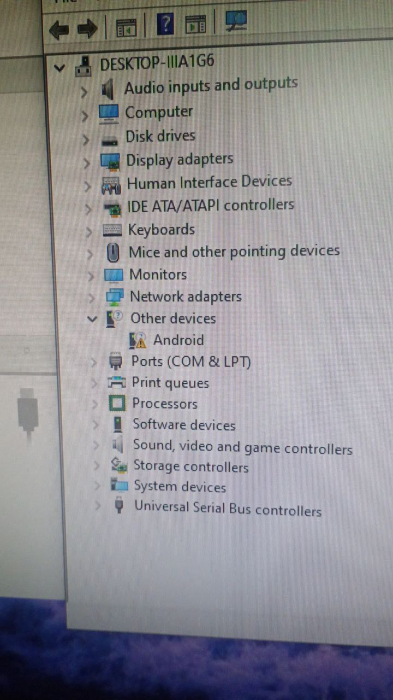

Step 1 : Switch phone to fastboot and connect to Windows PC
Step 2 : Open Device Manager and ensure it looks like this  

Step 3 : Download drivers : [Download]() and extract 
Step 4 : Right click on Android and click update and choose the exracted folder
Step 5 : Finsh ( it should now detect it as bootloader interface )

